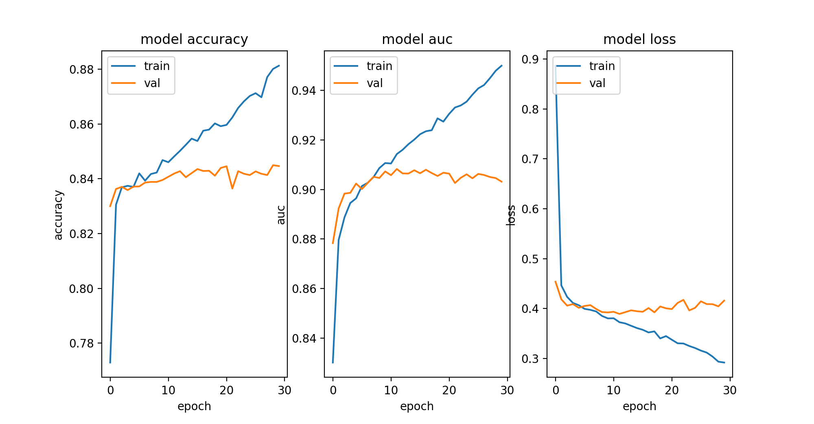

# DeepChrome implemented in Python. 
Deep-learning for predicting gene expression from histone modifications

Original repo: https://github.com/QData/DeepChrome

Deep-learning for predicting gene expression from histone modifications http://deepchrome.org
## Model Summary
<pre>
_________________________________________________________________
Layer (type)                 Output Shape              Param #   
=================================================================
conv1d_1 (Conv1D)            (None, 91, 50)            2550      
_________________________________________________________________
max_pooling1d_1 (MaxPooling1 (None, 18, 50)            0         
_________________________________________________________________
dropout_1 (Dropout)          (None, 18, 50)            0         
_________________________________________________________________
flatten_1 (Flatten)          (None, 900)               0         
_________________________________________________________________
Dense1 (Dense)               (None, 625)               563125    
_________________________________________________________________
Dense2 (Dense)               (None, 125)               78250     
_________________________________________________________________
Dense3 (Dense)               (None, 1)                 126       
=================================================================
Total params: 644,051
Trainable params: 644,051
Non-trainable params: 0

</pre>

## Results 
Results after running 20 epochs on E003 data.

the model appears to acheive best performance after aound 10 epoches of training, and start to overfit the train data after that.
